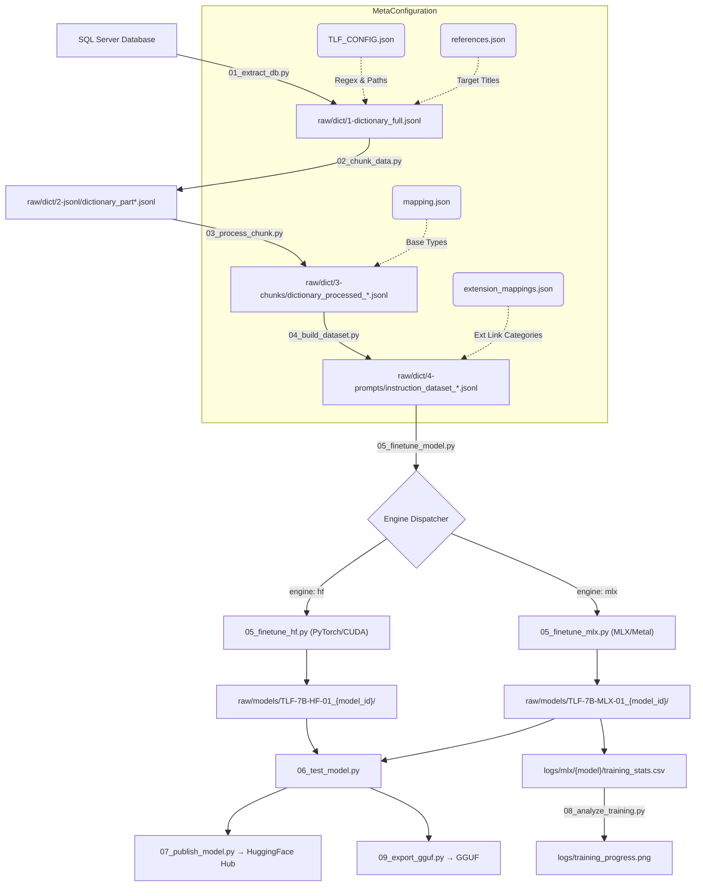
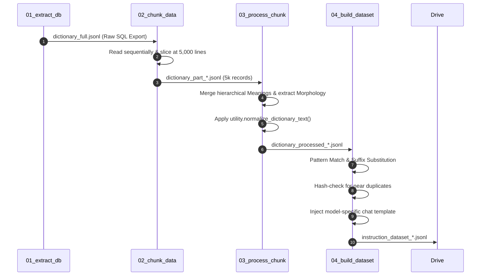
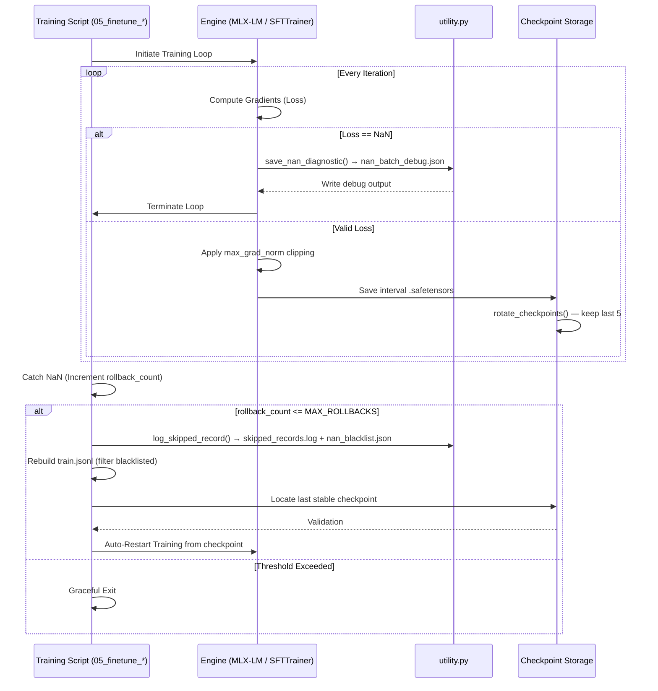
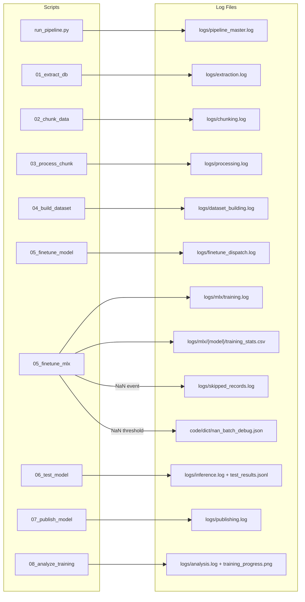

# 🛡️ TLF-7B-LLM-01: Ultra-Stable Dict-SFT Pipeline

[](https://www.python.org/downloads/)
[](LICENSE)
[](https://ml-explore.github.io/mlx/)
[](https://huggingface.co/assignarc/TLF-7B-LLM-01)

**TLF-7B-LLM-01** is a production-tested, end-to-end Supervised Fine-Tuning (SFT) pipeline that transforms raw MSSQL dictionary databases into specialized Indic LLMs. Currently running `sarvamai/sarvam-1` (7B), trained for **215,030 iterations** over ~23 hours on Apple M-series hardware. Supports both **Apple Silicon (MLX/Metal)** and **NVIDIA (HuggingFace/CUDA)** via a single config switch.

---

## ✨ Key Features

- 🔄 **End-to-End ETL**: Automated extraction from MSSQL to normalized, de-duplicated SFT datasets.
- 🛡️ **NaN-Resilient Training**: Advanced "Diagnostic Trap" and **Auto-Skip** (Rollback & Skip) mechanism.
- ⚡ **Ultra-Efficient Prompting**: Zero-Persona mode with symbolic keyword markers (`Def:`, `Trans:`, etc.) and metadata isolation.
- 🏗️ **Multi-Task SFT**: Specialized training for Morphology, Translation, Ontology, Etymology, and more.
- 🍎 **MLX Optimized**: Native support for Apple Silicon with global gradient clipping patches; 295 tok/s.
- ⚡ **QLoRA Precision**: 4-bit quantization for memory-efficient training on 7B+ parameter models.
- 🔍 **Landmine Defense**: Intelligent detection and blacklisting of problematic Indic character sequences.
- 📊 **Live Telemetry**: Per-iteration CSV logging, checkpoint rotation, NaN diagnostics, and training plots.
- 🔑 **Credential Isolation**: All secrets from `.env`; never in version-controlled `TLF_CONFIG.json`.

---

## 1. Executive Summary

The pipeline's objective is to extract a large-scale dictionary SQL database, map its hierarchical contents, identify cross-references, normalize morphological variations, and generate a multi-task SFT dataset specialized for training dynamically assigned models (e.g., `sarvamai/sarvam-1`, `meta-llama/Llama-2-7b-hf`, `meta-llama/Meta-Llama-3.1-8B`, `Qwen/Qwen2.5-7B`) via LoRA/QLoRA.

---

## 2. Global Architecture Flow



---

## 3. Configuration & Observability Reference

The pipeline is entirely driven by `code/dict/TLF_CONFIG.json`.

### 3.1 Metadata & Observability

| Parameter         | Section            | Usage & Importance                                                |
| :---------------- | :----------------- | :---------------------------------------------------------------- |
| `_metadata`     | **Metadata** | Tracks pipeline version, description, and last update date.       |
| `log_dir`       | **Logging**  | Root directory for all generated logs (Default:`logs`).         |
| `default_level` | **Logging**  | Set global verbosity:`DEBUG`, `INFO`, `WARNING`, `ERROR`. |
| `steps`         | **Logging**  | Maps each script to its specific output `.log` file.            |

### 3.2 Global Paths & Database

| Parameter               | Section            | Usage & Importance                                             |
| :---------------------- | :----------------- | :------------------------------------------------------------- |
| `connection_string`   | **Database** | ODBC string for Step 1 extraction. Requires ODBC Driver 18.    |
| `raw_dictionary_full` | **Paths**    | Target output file for the raw SQL dump (Step 1).              |
| `jsonl_input_dir`     | **Paths**    | Where Step 2 stores its subdivided 5,000-line chunks.          |
| `jsonl_output_dir`    | **Paths**    | Where Step 3 stores merged, contextualized chunks.             |
| `prompts_output_dir`  | **Paths**    | Final directory for model-formatted training data (Step 4).    |
| `mapping_file`        | **Paths**    | Maps internal DB types (e.g.,`wordnet.indo`) to human terms. |
| `extension_mappings`  | **Paths**    | Defines which DB extensions trigger which SFT Task.            |
| `references`          | **Paths**    | Maps reference codes to official textbook titles.              |

### 3.3 Data Processing (ETL)

| Parameter                      | Section              | Usage & Importance                                                  |
| :----------------------------- | :------------------- | :------------------------------------------------------------------ |
| `words_per_chunk`            | **Processing** | Lines per file in Step 2 to avoid RAM OOM (Default:`5000`).       |
| `exclude_keywords`           | **Processing** | Skip words containing these (e.g.,`"unknown"`, `"blank"`).      |
| `split_regex`                | **Processing** | How to separate definitions joined by "and", commas, or slashes.    |
| `seqno_extract_regex`        | **Processing** | Extracts numeric sequence numbers from meaning nodes.               |
| `dictionary_ref_regex`       | **Processing** | Extracts Manuscript Codes from HTML `<a>` tags.                   |
| `enable_suffix_substitution` | **Processing** | Toggles the zero-suffix substitution engine (Default:`false`).    |
| `suffix_substitution_regex`  | **Processing** | Merges Devanagari suffixes (e.g.,`०जाल` → `अंकजाल`). |
| `usage_ex_regex`             | **Processing** | Identifies the start of usage examples (e.g.,`Ex.`).              |
| `usage_quote_regex`          | **Processing** | Parses literary quotes and sources from usage text.                 |
| `meanings_per_record`        | **Processing** | Max meanings per SFT record (Default:`4`).                        |
| `max_chars_per_record_split` | **Processing** | Character limit before punctuation-aware split (Default:`1200`).  |

### 3.4 Model Personas (System Prompts)

| Parameter              | Task | Persona                                              |
| :--------------------- | :--- | :--------------------------------------------------- |
| `task_a_morphology`  | A    | Expert bilingual lexicographer.                      |
| `task_b_translation` | B    | Exact translation generator across Indian languages. |
| `task_c1_etymology`  | C1   | Expert morphological and etymological parser.        |
| `task_c2_ontology`   | C2   | Semantic relationship and synonym expert.            |
| `task_d_meronymy`    | D    | Part-whole relationship specialist.                  |
| `task_e_references`  | E    | Classical citation and reference expert.             |

### 3.5 Fine-Tuning & Inference

| Parameter             | Section               | Usage & Importance                                       | Reference                                                                                                              |
| :-------------------- | :-------------------- | :------------------------------------------------------- | :--------------------------------------------------------------------------------------------------------------------- |
| `engine`            | **Fine-tuning** | `mlx` (Apple Silicon) or `hf` (Nvidia/PyTorch).      | —                                                                                                                     |
| `model_id`          | **Fine-tuning** | Base HuggingFace model (Default:`sarvamai/sarvam-1`).  | —                                                                                                                     |
| `epochs`            | **Fine-tuning** | Total passes over dataset (Default:`5`).               | [Epochs](https://machinelearningmastery.com/difference-between-a-batch-and-an-epoch/)                                     |
| `batch_size`        | **Fine-tuning** | Keep at `1` on Mac Metal.                              | —                                                                                                                     |
| `learning_rate`     | **Fine-tuning** | Optimizer step size (Default:`2e-5`).                  | [LR Guide](https://machinelearningmastery.com/understand-the-dynamics-of-learning-rate-on-deep-learning-neural-networks/) |
| `lora_r`            | **Fine-tuning** | Adapter rank (Default:`32`).                           | [LoRA Paper](https://arxiv.org/abs/2106.09685)                                                                            |
| `max_seq_length`    | **Fine-tuning** | Context window limit (Default:`1024`).                 | —                                                                                                                     |
| `max_grad_norm`     | **Fine-tuning** | Gradient clipping (Default:`0.05`). Critical on Metal. | —                                                                                                                     |
| `max_nan_threshold` | **Fine-tuning** | Consecutive NaN tolerance before action (Default:`3`). | —                                                                                                                     |
| `nan_action`        | **Fine-tuning** | `rollback-skip` / `rollback` / `terminate`.        | —                                                                                                                     |
| `max_rollbacks`     | **Fine-tuning** | Hard cap on auto-rollback attempts (Default:`200`).    | —                                                                                                                     |
| `temperature`       | **Inference**   | `0.3` factual (dictionary), `0.7+` creative.         | —                                                                                                                     |
| `top_p`             | **Inference**   | Nucleus sampling probability (Default:`0.9`).          | —                                                                                                                     |

### 3.6 Security & Environment Variables

Sensitive credentials are loaded at runtime from `.env` — never stored in `TLF_CONFIG.json`:

```env
DB_CONNECTION_STRING="Driver={ODBC Driver 18};Server=...;Database=...;"
HF_TOKEN="hf_xxxxxxxxxxxxxxxxxxxx"
```

`utility.py → load_config()` injects `DB_CONNECTION_STRING` → `database.connection_string` and `HF_TOKEN` → `finetuning.hf_token`.

---

## 4. Step-by-Step Pipeline Execution

### 4.1 ETL Data Flow Sequence



### Step 1: Database Extraction (`01_extract_db.py`)

Queries the target MSSQL server, pulls all `Word` objects with nested `Meaning` objects, resolving links and mappings.

**Regex — HTML Reference Parsing:**

- **Pattern:** `r'<a href="/dictionary/(?P<InternalCode>[^/]+)/text\?ref=(?P<ReferenceCode>[^"]+)"[^>]*>(?P<RefText>[^<]+)</a>'`
- **Purpose:** Raw `MeaningText` contains `<a>` tags pointing to manuscripts (e.g., `text.manu`). Extracts internal code, reference manuscript, and visible text.
- **Reference Audit:** Injects data from `references.json` to resolve manuscript `Title`. Generates `reference_extraction_report.csv` — every code either mapped or flagged `"NOT FOUND"`.

### Step 2: File Chunking (`02_chunk_data.py`)

Reads `dictionary_full.jsonl` sequentially using low-memory file buffering. Slices into discrete blocks of 5,000 lines (`dictionary_part_*.jsonl`) to prevent OOM during Python processing and HuggingFace Dataset loading.

### Step 3: Chunk Processing & Meaning Merging (`03_process_chunk.py`)

Consolidates multi-step sequential definitions attached to a single term.

- **Logic:** If multiple meaning entries belong to the same `Source` dictionary, it concatenates their text and harvests all child `References`, `ManagedType` arrays, and `ExtensionLinks` before merging. No citations are lost during compression.
- **Exception:** Entries tagged `wordnet.indo` or with specialized `Extensions` arrays are passed **unmodified** to preserve their structured mappings.
- All text passes through `utility.normalize_dictionary_text()` (see §5.1).

### Step 4: SFT Dataset Generation (`04_build_dataset.py`)

Translates normalized JSON into model-specific instruction blocks from `TLF_CONFIG.json → prompt_templates` using the **Ultra-Efficient Zero-Persona profile**.

**Zero-Persona Profile:**

- Skips the `<<SYS>>` block to save ~25 tokens per prompt, improving model focus.
- Uses keyword markers instead of natural language: `Def:` → Definition, `Trans:` → Translations, `Syn:` → Synonyms, `Cite:` → Citations.

**Regex 1 — Suffix Substitution (`०([^\W\d_]+)`):**

- **Purpose:** Sub-entries defined as root suffixes (e.g., word=`"अंक"`, meaning=`"०जाल"`) are merged to `"अंकजाल"`.
- **Configurable:** `enable_suffix_substitution` flag (default `false`).
- **False Positive Guard:** `[^\W\d_]+` forbids numbers — `"०९"` stays unmodified.

**Regex 2 — Usage Extraction (`\bEx\.\s+` and `'([^']+)'\s*-\s*([^.]+)\.`):**

- Extracts localized literary quotes from base text, formatting them as "Usage Examples".

**Categorized Tasks (from `extension_mappings.json`):**

- **Task A (Lexicography):** Primary dictionary translation with `WordTextAlternate` inline as `(also: Alt1, Alt2)`.
- **Task B (Translation):** Handles `iwn.lang.*` cross-translation targets.
- **Task C1 & C2 (Ontology & Etymology):** Root compounds and relationship trees.
- **Task D (Meronymy/Holonymy):** Subset-superset mappings.
- **Task E (Citations):** Literary citations only, deduplicated per word concept.

### Step 5: Multi-Engine Fine-tuning

#### Engine A — MLX (`05_finetune_mlx.py`)

- **Dispatcher:** `05_finetune_model.py` reads `engine` from config and calls this script.
- **Checkpoint Rotation:** Keeps last 5 `*_adapters.safetensors` files; deletes older ones to prevent SSD exhaustion.
- **Resume:** Auto-resumes if `adapters.safetensors` exists. Use `--force-restart` to wipe and restart.
- **Stats:** Writes per-iteration metrics to `logs/mlx/{safe_model_id}/training_stats.csv` in real time.
- **NaN Recovery:** Full Rollback-Skip loop (see §5.3 and §6).
- **CLI Overrides:** `--iters`, `--max-seq-length`, `--skip-iters`, `--max-nan-threshold`, `--nan-action`.

**Gradient Clipping Patch (Required for MLX ≤0.31.1):**

`mlx-lm` does not expose `max_grad_norm` through its CLI in older versions. A direct patch to `mlx_lm/tuner/trainer.py` is required:

```python
# BEFORE patch
loss, grads = loss_and_grad_fn(model, batch)
optimizer.update(model, grads)  # No clipping!

# AFTER patch
loss, grads = loss_and_grad_fn(model, batch)
grads, _ = mx.clip_grad_norm(grads, max_norm=config["max_grad_norm"])
optimizer.update(model, grads)
```

Config: `max_grad_norm` in `TLF_CONFIG.json` (Default: `0.05`).

#### Engine B — HuggingFace (`05_finetune_hf.py`)

- **Hardware:** Optimized for Nvidia GPUs via CUDA.
- **Logic:** Uses `SFTTrainer` with 4-bit QLoRA via `bitsandbytes`.
- **Storage:** Saves to `raw/models/TLF-7B-HF-01_{model_id}/` using `checkpoint-NNN/` folders.
- **CLI Overrides:** `--iters` (maps to `max_steps`), `--max-seq-length`.

---

## 5. Data Quality & Stability Guards

### 5.1 Systemic Text Normalization (`utility.normalize_dictionary_text()`)

All content passes through this before dataset construction:

- **HTML Unescaping:** `&amp;` → `&`, `&lt;` → `<`, etc.
- **Number Standardization:** `4, 32, 000` → `4,32,000` — prevents tokenizer byte-fallback fragmentation.
- **Whitespace Compression:** Collapses multiple spaces/newlines for consistent attention density.
- **Reference Cleaning:** Replaces `+` classical citation markers with spaces — `+` causes `<unk>` token insertion in Sarvam-1's tokenizer.

### 5.2 Near-Duplicate Suppression (`04_build_dataset.py`)

- **Hash Logic:** `hash(Prompt + Response[:500])`
- **Impact:** Reduces dataset size by ~15%, removing redundant instructions that cause over-fitting and gradient spikes.

### 5.3 Automated Diagnostic Trap & Rollback

Both MLX and HF engines have a unified "Diagnostic Trap" and Auto-Rollback:



- **Detection:** `loss == NaN` immediately terminates the subprocess.
- **Recovery:** Locates last-numbered `*_adapters.safetensors`, restarts from it.
- **Diagnostic Capture:** `save_nan_diagnostic()` writes the exact offending record to `nan_batch_debug.json`.
- **Blacklisting:** `log_skipped_record()` appends to `skipped_records.log` and `nan_blacklist.json`. Dataset is rebuilt without blacklisted records on the next loop iteration.

### 5.4 The "Landmine" Defense (ETL Step 4)

Certain complex Devanagari compounds trigger numerical collapse on Apple Silicon MPS regardless of hyperparameters.

- **Blacklisting:** `validate_content()` in `04_build_dataset.py` contains a hard-coded blacklist for identified "landmine" words (e.g., `अभिसम्भृत`).
- **Pruning:** These words are removed during Step 4 prompt generation, ensuring `train.jsonl` is numerically safe.

---

## 6. NaN Rollback-Skip System Deep Dive

Core implementation in `05_finetune_mlx.py`, utilities in `utility.py`.

```
Training Loop
    │
    ├─► Loss valid  ──► Log stats to CSV, save checkpoint every save_steps iters
    │                    rotate_checkpoints(): keep last 5, delete older
    │
    └─► Loss == NaN
            │
            ├─ consecutive_nans < max_nan_threshold  ──► Log WARNING, continue
            │
            └─ consecutive_nans >= max_nan_threshold
                    │
                    ├─► save_nan_diagnostic()      → code/dict/nan_batch_debug.json (overwrites)
                    │
                    ├─► nan_action == "terminate"   ──► sys.exit()
                    │
                    ├─► nan_action == "rollback"
                    │       └─► find_last_stable_checkpoint()
                    │           mlx_config["resume_adapter_file"] = last checkpoint
                    │           Restart Popen (mlx_lm.lora)
                    │
                    └─► nan_action == "rollback-skip"
                            ├─► log_skipped_record()  → logs/skipped_records.log (appends)
                            ├─► get_nan_blacklist()   → nan_blacklist.json (grows)
                            ├─► Rebuild train.jsonl   (filter blacklisted indices)
                            └─► Restart from last checkpoint
```

**Config knobs:**

| Key                   |       Default       | Effect                                                |
| :-------------------- | :-----------------: | :---------------------------------------------------- |
| `max_nan_threshold` |        `3`        | Consecutive NaN iterations before action triggers     |
| `nan_action`        | `"rollback-skip"` | `terminate` / `rollback` / `rollback-skip`      |
| `max_rollbacks`     |       `200`       | Hard cap on total rollback attempts per session       |
| `save_steps`        |       `100`       | Checkpoint interval (determines rollback granularity) |
| `max_grad_norm`     |      `0.05`      | Gradient clipping — the primary NaN prevention layer |

**CLI overrides (no config edit needed):**

```bash
python code/dict/05_finetune_mlx.py \
  --max-nan-threshold 5 \
  --nan-action rollback-skip \
  --iters 500 \
  --max-seq-length 256
```

---

## 7. Repository Structure

```
TLF-LLM-Pipeline/
│
├── code/dict/                          ← All pipeline scripts
│   ├── run_pipeline.py                 ← Master orchestrator (entry point)
│   ├── 01_extract_db.py               ← Step 1: MSSQL → raw JSONL
│   ├── 02_chunk_data.py               ← Step 2: Split into 5k-line chunks
│   ├── 03_process_chunk.py            ← Step 3: Normalize, merge meanings
│   ├── 04_build_dataset.py            ← Step 4: Build SFT instruction records
│   ├── 05_finetune_model.py           ← Step 5: Engine dispatcher (MLX vs HF)
│   ├── 05_finetune_mlx.py             ← Step 5a: MLX/Metal training loop + NaN recovery
│   ├── 05_finetune_hf.py              ← Step 5b: HuggingFace/CUDA QLoRA training
│   ├── 06_test_model.py               ← Step 6: Interactive inference CLI
│   ├── 07_publish_model.py            ← Step 7: HuggingFace Hub publisher + model card
│   ├── 08_analyze_training.py         ← Step 8: Loss curve plotting & stats
│   ├── 09_export_gguf.py              ← Step 9: Merge adapters + GGUF quantization
│   ├── utility.py                     ← Shared: logging, config, NaN diagnostics, I/O
│   ├── TLF_CONFIG.json                ← Central pipeline configuration
│   ├── mapping.json                   ← DB type → human label mapping
│   ├── extension_mappings.json        ← DB extension → SFT task mapping
│   ├── references.json                ← Reference code → manuscript title
│   └── nan_batch_debug.json           ← [RUNTIME] Last NaN incident snapshot (overwrites)
│
├── raw/
│   ├── dict/                          ← ETL data lake (all pipeline stages)
│   │   ├── 1-dictionary_full.jsonl    ← Step 1 output: full raw SQL dump (~2.2 GB)
│   │   ├── 2-jsonl/                   ← Step 2 output: 231 × ~9 MB chunk files
│   │   │   └── dictionary_part001-231.jsonl
│   │   ├── 3-chunks/                  ← Step 3 output: processed/normalized chunks
│   │   │   └── dictionary_processed_*.jsonl
│   │   ├── 4-prompts/                 ← Step 4 output: SFT instruction records
│   │   │   └── instruction_dataset_*.jsonl
│   │   ├── 5-finetune/                ← [deprecated] old finetune staging area
│   │   ├── reference_extraction_report.csv  ← Audit: all refs resolved or missing
│   │   ├── unique_types_and_genders.md      ← Analysis: DB type/gender inventory
│   │   ├── unmatched_references_log.txt     ← Audit: refs not in references.json
│   │   └── unparsed_types_report.md         ← Analysis: unparseable type annotations
│   │
│   └── models/                        ← Trained adapter outputs
│       ├── TLF-7B-MLX-01_sarvamai_sarvam-1/   ← PRODUCTION MODEL (215k iters)
│       │   ├── adapters.safetensors            ← Final LoRA weights (loaded by Step 6)
│       │   ├── 0214600_adapters.safetensors   ← Rolling checkpoint
│       │   ├── 0215000_adapters.safetensors   ← Rolling checkpoint
│       │   ├── adapter_config.json            ← Hyperparameter snapshot (relative paths)
│       │   ├── mlx_config.yaml                ← MLX-LM config (auto-generated, relative)
│       │   ├── nan_blacklist.json             ← [RUNTIME] Blacklisted iteration indices
│       │   ├── README.md                      ← HuggingFace Model Card
│       │   └── data/
│       │       ├── train.jsonl                ← Filtered training set (~882 MB)
│       │       └── valid.jsonl                ← Validation split (first 100 records)
│       ├── TLF-7B-MLX-01/                    ← [older] Llama-2 attempt
│       └── TLF-7B-HF-01/                     ← [older] HuggingFace engine attempt
│
├── logs/                              ← All runtime observability artifacts
│   ├── pipeline_master.log            ← Master orchestrator log (run_pipeline.py)
│   ├── extraction.log                 ← Step 1: DB extraction events
│   ├── chunking.log                   ← Step 2: chunk file creation events (~199 KB)
│   ├── processing.log                 ← Step 3: per-record normalization (~1.1 MB)
│   ├── dataset_building.log           ← Step 4: SFT record construction (~4.2 MB)
│   ├── finetune_dispatch.log          ← Step 5: engine selection + CLI args forwarded
│   ├── inference.log                  ← Step 6: inference session events + responses
│   ├── publishing.log                 ← Step 7/9: HF Hub upload events
│   ├── analysis.log                   ← Step 8: analytics summary
│   ├── skipped_records.log            ← NaN blacklist: all auto-skipped records (appends)
│   ├── test_results_TLF-7B-MLX-01.jsonl  ← Step 6 structured test outputs
│   ├── training_progress.png          ← Step 8 output: loss curve plot
│   └── mlx/                           ← MLX engine telemetry (per-model subdirs)
│       ├── training.log               ← Full MLX stdout log (~5 MB, ~27k lines)
│       ├── sarvamai_sarvam-1/
│       │   ├── training_stats.csv             ← Per-iteration metrics (21,504 rows)
│       │   ├── training_stats_20260323_183755.csv  ← Versioned on --force-restart
│       │   └── training_stats_20260323_183833.csv
│       └── meta-llama-2-7B/           ← Failed Llama-2 sessions (30 versioned files)
│           └── training_stats_*.csv
│
├── requirements.txt
├── .env                               ← Secrets: DB + HF credentials (NOT committed)
└── .gitignore
```

---

## 8. Observability & Log Reference

Every script writes to **two streams simultaneously**: console (stdout) and a dedicated log file, configured via `TLF_CONFIG.json → logging.steps` and initialized with `utility.setup_logger(step_name=...)`.

### 8.1 Log Flow Architecture



### 8.2 Log Files — Complete Registry

| Log File                                          | Size     | Generated By                                   | What's Inside                                                     | Key For              |
| :------------------------------------------------ | :------- | :--------------------------------------------- | :---------------------------------------------------------------- | :------------------- |
| `logs/pipeline_master.log`                      | ~128 KB  | `run_pipeline.py`                            | Step boundaries, subprocess exits, errors                         | End-to-end run audit |
| `logs/extraction.log`                           | ~1.2 KB  | `01_extract_db.py`                           | DB connection, record counts, reference hits                      | Step 1 debug         |
| `logs/chunking.log`                             | ~199 KB  | `02_chunk_data.py`                           | Per-chunk file creation, line counts                              | Step 2 validation    |
| `logs/processing.log`                           | ~1.1 MB  | `03_process_chunk.py`                        | Per-record normalization events, skips                            | Meaning merge audit  |
| `logs/dataset_building.log`                     | ~4.2 MB  | `04_build_dataset.py`                        | SFT record construction, dedup events                             | Dataset quality      |
| `logs/finetune_dispatch.log`                    | ~18 KB   | `05_finetune_model.py`                       | Engine selected, CLI args, crash timestamps                       | Training history     |
| `logs/mlx/training.log`                         | ~5 MB    | `05_finetune_mlx.py`                         | All MLX stdout: loss, lr, tok/s, NaN warnings                     | Primary debugger     |
| `logs/mlx/sarvamai_sarvam-1/training_stats.csv` | ~1.5 MB  | `05_finetune_mlx.py`                         | Per-iter: Iter, TrainLoss, ValLoss, LR, It/s, Tokens/s, PeakMemGB | Step 8 + convergence |
| `logs/mlx/meta-llama-2-7B/training_stats_*.csv` | 30 files | `05_finetune_mlx.py`                         | All Llama-2 failed attempts, NaN timestamps                       | Failure analysis     |
| `logs/inference.log`                            | ~42 KB   | `06_test_model.py`                           | Model load, prompt/response pairs, errors                         | Inference quality    |
| `logs/test_results_TLF-7B-MLX-01.jsonl`         | ~21 KB   | `06_test_model.py`                           | `{timestamp, prompt, response, response_base}`                  | Base vs finetuned    |
| `logs/publishing.log`                           | ~8 KB    | `07_publish_model.py`, `09_export_gguf.py` | HF upload events, model card generation                           | Deploy audit         |
| `logs/analysis.log`                             | ~642 B   | `08_analyze_training.py`                     | Initial/final/min train loss, final val loss                      | Convergence check    |
| `logs/skipped_records.log`                      | ~13 KB   | `utility.log_skipped_record()`               | Full text of every NaN-triggering record                          | NaN root cause       |

### 8.3 Runtime Diagnostics (Not in `logs/`)

| File                     | Location                | Generated By                      | When                       | Purpose                                                    |
| :----------------------- | :---------------------- | :-------------------------------- | :------------------------- | :--------------------------------------------------------- |
| `nan_batch_debug.json` | `code/dict/`          | `utility.save_nan_diagnostic()` | Every NaN threshold breach | Exact record + iter + tip.**Overwrites each event.** |
| `nan_blacklist.json`   | `raw/models/<model>/` | `utility.log_skipped_record()`  | On `rollback-skip`       | JSON array; read at each restart to rebuild train.jsonl    |
| `mlx_config.yaml`      | `raw/models/<model>/` | `05_finetune_mlx.py`            | Every training launch      | Exact MLX-LM config; relative paths for portability        |
| `adapter_config.json`  | `raw/models/<model>/` | `05_finetune_mlx.py`            | Every training launch      | Hyperparameter snapshot; relative paths since v2.1         |

### 8.4 `training_stats.csv` — Column Reference

| Column            | Type           | Description                        | Debug Signal                         |
| :---------------- | :------------- | :--------------------------------- | :----------------------------------- |
| `Iter`          | int            | MLX iteration number               | Timeline anchor                      |
| `TrainLoss`     | float /`nan` | Training loss                      | `nan` = NaN event; should trend ↓ |
| `ValLoss`       | float          | Validation loss (every ~200 iters) | Generalization gap vs TrainLoss      |
| `LearningRate`  | float (sci)    | Effective LR                       | Verify cosine decay is working       |
| `ItSec`         | float          | Iterations per second              | Drop = memory pressure / swap        |
| `TokensSec`     | float          | Tokens per second                  | Stable = no Metal thrashing          |
| `TrainedTokens` | int            | Cumulative tokens trained          | Dataset coverage tracking            |
| `PeakMemGB`     | float          | Peak unified memory (GB)           | >15 GB = OOM risk zone               |
| `Timestamp`     | datetime       | Wall-clock time                    | Compute actual elapsed duration      |

### 8.5 `skipped_records.log` — Format

```
[2026-03-23 06:50:02] ITERATION: 5590
RECORD SNIPPET: <s>[INST] Def: puerile [/INST] "puerile" Def: PUERILE , a. ...
FULL RECORD DATA: {"text": "<s>[INST] Def: puerile [/INST] ..."}
--------------------------------------------------------------------------------
```

Each entry = one auto-skipped record. Reveals **which constructs** trigger NaN: byte-fallback tokens, spaced numbers, or `+` classical markers.

### 8.6 `nan_batch_debug.json` — Format

```json
{
  "iteration": "20",
  "timestamp": "2026-03-23T00:46:15.679859",
  "record": { "text": "<s>[INST] Def: गिष्णु [/INST] \"गिष्णु\" Def: m. a professional singer..." },
  "note": "NaN limit hit. Action: rollback",
  "tip": "Reduce max_seq_length, lora_r, or check for spikes in definitions."
}
```

**Check this first** when a session exits abnormally — pinpoints the exact triggering record.

---

## 9. Script Reference

### ETL & Data

| Module                  | Purpose                                         | Primary Inputs                                |
| :---------------------- | :---------------------------------------------- | :-------------------------------------------- |
| `01_extract_db.py`    | MSSQL → JSONL + reference resolution           | `TLF_CONFIG.json` (DB), `references.json` |
| `02_chunk_data.py`    | Slice large JSONL into 5k-line segments         | `dictionary_full.jsonl`                     |
| `03_process_chunk.py` | Merge sequential meanings, extract types        | `mapping.json`, chunk files                 |
| `04_build_dataset.py` | Generate model-specific SFT instruction records | `extension_mappings.json`                   |

### Training

| Module                   | Purpose                                                 | Primary Inputs                  |
| :----------------------- | :------------------------------------------------------ | :------------------------------ |
| `05_finetune_model.py` | Dispatcher: reads `engine` flag, forwards all args    | `TLF_CONFIG.json`             |
| `05_finetune_mlx.py`   | Full MLX training loop + rollback + checkpoint rotation | `instruction_dataset_*.jsonl` |
| `05_finetune_hf.py`    | 4-bit QLoRA via SFTTrainer for Nvidia CUDA              | `instruction_dataset_*.jsonl` |

### Testing, Publishing & Analytics

| Module                     | Purpose                                                                                                                                                                 | Primary Inputs                   |
| :------------------------- | :---------------------------------------------------------------------------------------------------------------------------------------------------------------------- | :------------------------------- |
| `06_test_model.py`       | Interactive terminal inference;`--compare` for base vs finetuned                                                                                                      | Adapter dir,`inference` config |
| `07_publish_model.py`    | Auto-generate model card + upload to HF Hub                                                                                                                             | Adapter dir,`HF_TOKEN`         |
| `08_analyze_training.py` | Plot Train/Val loss curves; print convergence stats                                                                                                                     | `training_stats.csv`           |
| `09_export_gguf.py`      | Merge LoRA → full weights → GGUF via llama.cpp                                                                                                                        | Adapter dir                      |
| `utility.py`             | `setup_logger()`, `load_config()`, `save_nan_diagnostic()`, `log_skipped_record()`, `get_nan_blacklist()`, `normalize_dictionary_text()`, `createJSONL()` | Universal                        |
| `run_pipeline.py`        | Top-level orchestrator; wraps steps 1–8 with subprocess + live log streaming                                                                                           | All scripts                      |

### Prompt Templates — All Supported Models

| `model_id`                     | Chat Template Format                                                                                  |
| :------------------------------- | :---------------------------------------------------------------------------------------------------- |
| `meta-llama/Llama-2-7b-hf`     | `<s>[INST] {user_prompt} [/INST] {target} </s>`                                                     |
| `meta-llama/Meta-Llama-3.1-8B` | `<\|begin_of_text\|><\|start_header_id\|>user<\|end_header_id\|>\n\n{user_prompt}<\|eot_id\|>...`           |
| `Qwen/Qwen2.5-7B`              | `<\|im_start\|>user\n{user_prompt}<\|im_end\|>\n<\|im_start\|>assistant\n{target}<\|im_end\|>`              |
| `sarvamai/sarvam-1`            | `<bos><start_of_turn>user\n{user_prompt}<end_of_turn>\n<start_of_turn>model\n{target}<end_of_turn>` |

> **Note:** `06_test_model.py` uses a hardcoded Llama-2 `[INST]` prompt for Sarvam-1 inference — Sarvam-1 stores this template internally in its `tokenizer_config.json` despite being a base (not instruct-tuned) model.

---

## 10. Pipeline Execution Guide

```bash
# ─── ETL ───────────────────────────────────────────────────────
python code/dict/run_pipeline.py --step 1   # MSSQL → dictionary_full.jsonl
python code/dict/run_pipeline.py --step 2   # Slice into 5k-line chunks
python code/dict/run_pipeline.py --step 3   # Normalize + merge meanings
python code/dict/run_pipeline.py --step 4   # Build SFT instruction records

# ─── TRAINING ──────────────────────────────────────────────────
python code/dict/run_pipeline.py --step 5                                  # Standard (auto-resumes)
python code/dict/run_pipeline.py --step 5 --force-restart                  # Wipe + fresh start
python code/dict/run_pipeline.py --step 5 --resume-from-checkpoint         # Explicit resume
python code/dict/run_pipeline.py --step 5 --input_file raw/dict/4-prompts/instruction_dataset_1.jsonl

# Direct script — override config without editing TLF_CONFIG.json:
python code/dict/05_finetune_mlx.py --iters 100 --max-seq-length 256 --nan-action terminate
python code/dict/05_finetune_mlx.py --skip-iters 5000   # Manual skip past known-bad region

# ─── EVALUATION ────────────────────────────────────────────────
python code/dict/06_test_model.py                          # interactive inference
python code/dict/06_test_model.py --prompt "Define 'असुर'"
python code/dict/06_test_model.py --compare                # base vs finetuned side-by-side
python code/dict/06_test_model.py --base-only              # base model only (no adapter)

# ─── ANALYTICS ─────────────────────────────────────────────────
python code/dict/run_pipeline.py --step 8    # logs/training_progress.png

# ─── PUBLISHING ────────────────────────────────────────────────
python code/dict/07_publish_model.py --dry-run                               # preview model card
python code/dict/07_publish_model.py --repo_id your-username/TLF-7B-LLM-01  # upload
python code/dict/09_export_gguf.py --quantization Q4_K_M                    # GGUF export
```

---

## 11. Raw Data & Adapter File Reference

### Data Stage Flow

| Stage | Directory                   | File Pattern                     |       Size       | Producer                | Consumer                |
| :---: | :-------------------------- | :------------------------------- | :--------------: | :---------------------- | :---------------------- |
|   1   | `raw/dict/`               | `1-dictionary_full.jsonl`      |     ~2.2 GB     | `01_extract_db.py`    | `02_chunk_data.py`    |
|   2   | `raw/dict/2-jsonl/`       | `dictionary_part001-231.jsonl` |    ~9 MB each    | `02_chunk_data.py`    | `03_process_chunk.py` |
|   3   | `raw/dict/3-chunks/`      | `dictionary_processed_*.jsonl` |      varies      | `03_process_chunk.py` | `04_build_dataset.py` |
|   4   | `raw/dict/4-prompts/`     | `instruction_dataset_*.jsonl`  |      varies      | `04_build_dataset.py` | `05_finetune_mlx.py`  |
|   5   | `raw/models/<name>/data/` | `train.jsonl`, `valid.jsonl` | ~882 MB / ~30 MB | `05_finetune_mlx.py`  | `mlx_lm.lora`         |

### Adapter Directory — File Reference

| File                             | Description                        | Notes                                                     |
| :------------------------------- | :--------------------------------- | :-------------------------------------------------------- |
| `adapters.safetensors`         | Final/latest LoRA adapter weights  | Loaded by `06_test_model.py`; uploaded by Step 7        |
| `NNNNNNN_adapters.safetensors` | Rolling checkpoint at iter NNNNNNN | Kept last 5 by `rotate_checkpoints()`                   |
| `adapter_config.json`          | Training config snapshot           | Relative paths since v2.1; safe to commit                 |
| `mlx_config.yaml`              | MLX-LM YAML config for this run    | Auto-generated; relative paths                            |
| `data/train.jsonl`             | Filtered training set              | Rebuilt on each rollback with blacklisted records removed |
| `data/valid.jsonl`             | First 100 records of chunk 1       | Fixed validation split                                    |
| `nan_blacklist.json`           | Blacklisted iteration numbers      | Grows on each `rollback-skip` event                     |
| `README.md`                    | HuggingFace Model Card             | Auto-generated if missing; preserved if manually edited   |

### Audit Files in `raw/dict/`

| File                                | Generated By         | Purpose                                                                                            |
| :---------------------------------- | :------------------- | :------------------------------------------------------------------------------------------------- |
| `reference_extraction_report.csv` | `01_extract_db.py` | Maps every `<a>` tag to resolved manuscript title; `"NOT FOUND"` = gaps in `references.json` |
| `unmatched_references_log.txt`    | `01_extract_db.py` | Reference codes not found in `references.json`                                                   |
| `unique_types_and_genders.md`     | Analysis tool        | All DB type/gender values — used to update `mapping.json`                                       |
| `unparsed_types_report.md`        | Analysis tool        | Records whose `ManagedType` could not be parsed by Step 3                                        |

---

## 12. Configuration Reference (`TLF_CONFIG.json`)

### Logging Block — Step-to-File Mapping

```json
"logging": {
  "log_dir": "logs",
  "default_level": "INFO",
  "steps": {
    "extraction":        "extraction.log",
    "chunking":          "chunking.log",
    "processing":        "processing.log",
    "dataset_building":  "dataset_building.log",
    "finetune_dispatch": "finetune_dispatch.log",
    "mlx_training":      "mlx/training.log",
    "inference":         "inference.log",
    "publishing":        "publishing.log",
    "analysis":          "analysis.log",
    "pipeline_master":   "pipeline_master.log"
  }
}
```

To add a log for a new script: add an entry here and call `setup_logger(step_name="your_key")`.

### Fine-tuning Block (Ultra-Stable Profile — Current Production)

```json
"finetuning": {
  "engine":                      "mlx",
  "model_id":                    "sarvamai/sarvam-1",
  "lora_r":                      32,
  "lora_alpha":                  16,
  "lora_dropout":                0.1,
  "learning_rate":               2e-5,
  "max_grad_norm":               0.05,
  "max_seq_length":              1024,
  "batch_size":                  1,
  "gradient_accumulation_steps": 64,
  "save_steps":                  100,
  "max_nan_threshold":           3,
  "nan_action":                  "rollback-skip",
  "max_rollbacks":               200,
  "warmup_ratio":                0.03,
  "lr_scheduler_type":           "cosine"
}
```

---

## 13. Troubleshooting Guide

### Training exits immediately with NaN

1. Check `code/dict/nan_batch_debug.json` — see the exact triggering record
2. Check `logs/skipped_records.log` — see all historical NaN records
3. Lower `max_grad_norm` (try `0.01`)
4. Lower `max_seq_length` (try `256`)
5. Switch to `--nan-action rollback-skip` to auto-blacklist and continue

### `PeakMemGB > 14` in `training_stats.csv`

- Reduce `max_seq_length` (halving roughly quarters memory)
- Reduce `lora_r` from `32` → `16`
- Ensure `batch_size: 1` (already default)

### `TokensSec` drops mid-run

- Metal is swapping to system RAM — memory pressure too high
- Reduce `max_seq_length` or `lora_r`
- Restart with `--force-restart` to clear fragmented state

### Adapter not found by `06_test_model.py`

- Verify `raw/models/<TARGET_MODEL_NAME>_<safe_model_id>/adapters.safetensors` exists
- Check `TLF_CONFIG.json → finetuning.model_id` matches what Step 5 used
- Check `logs/inference.log` for the resolved adapter path

### HuggingFace upload fails

- Verify `HF_TOKEN` is in `.env`
- Run `--dry-run` first to validate the model card locally
- Check `logs/publishing.log` for the exact error

---

## 14. Development & Maintenance

To add a new task to the pipeline:

1. Define the task persona in `TLF_CONFIG.json → system_prompts`.
2. Update `extension_mappings.json` to trigger the task for specific DB extensions.
3. Add the log entry to `TLF_CONFIG.json → logging.steps`.
4. Use `utility.setup_logger(step_name="...")` for consistent observability.
5. Verify convergence via Step 8 (`08_analyze_training.py`).

---

## 🤝 Contributing


Pull requests welcome — please open an issue first for major changes.

## 📄 License

MIT License — see [`LICENSE`](LICENSE).

---

> [!NOTE]
> `nan_batch_debug.json` **overwrites** on each NaN event. For full history, use `logs/skipped_records.log` which appends permanently. The `training_stats.csv` is the ground-truth for convergence — load with `pandas` or run Step 8 to auto-plot.

> [!TIP]
> After any config change, run a 100-iteration smoke test:
> `python code/dict/05_finetune_mlx.py --iters 100 --nan-action terminate`
> Check `logs/mlx/sarvamai_sarvam-1/training_stats.csv` to confirm stable loss before a full run.
