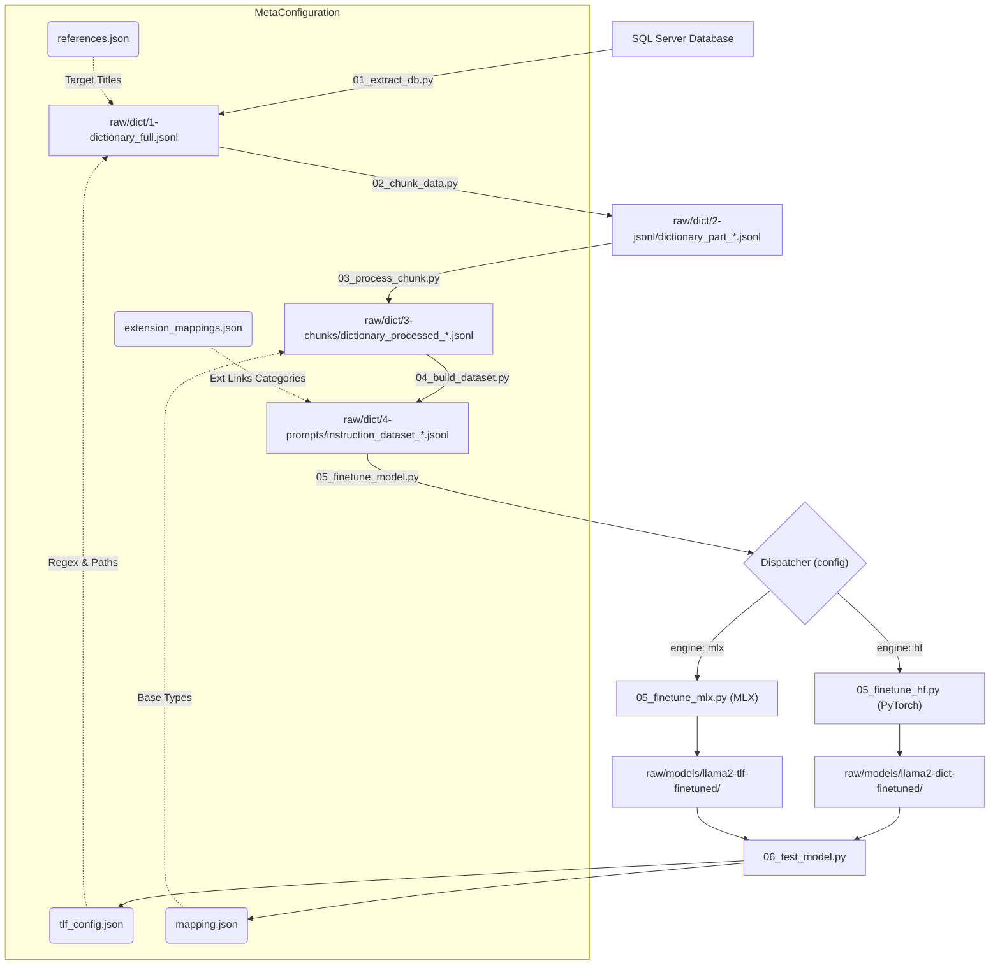
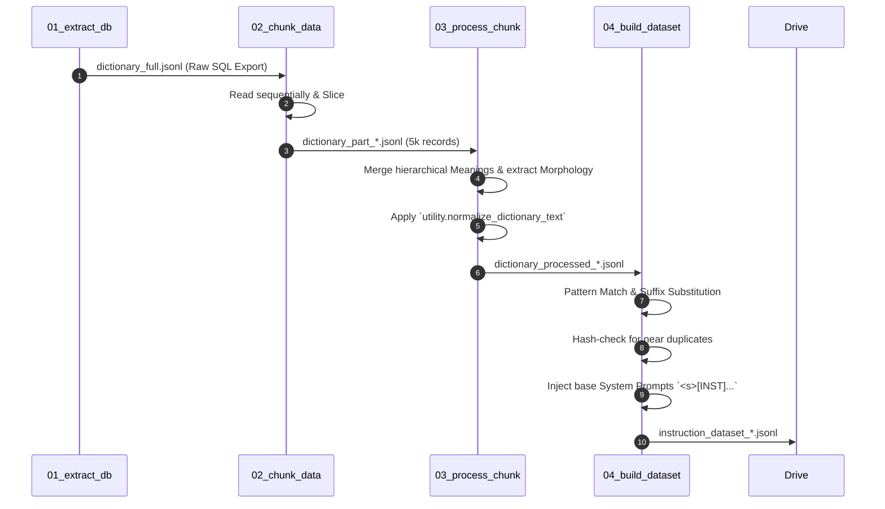
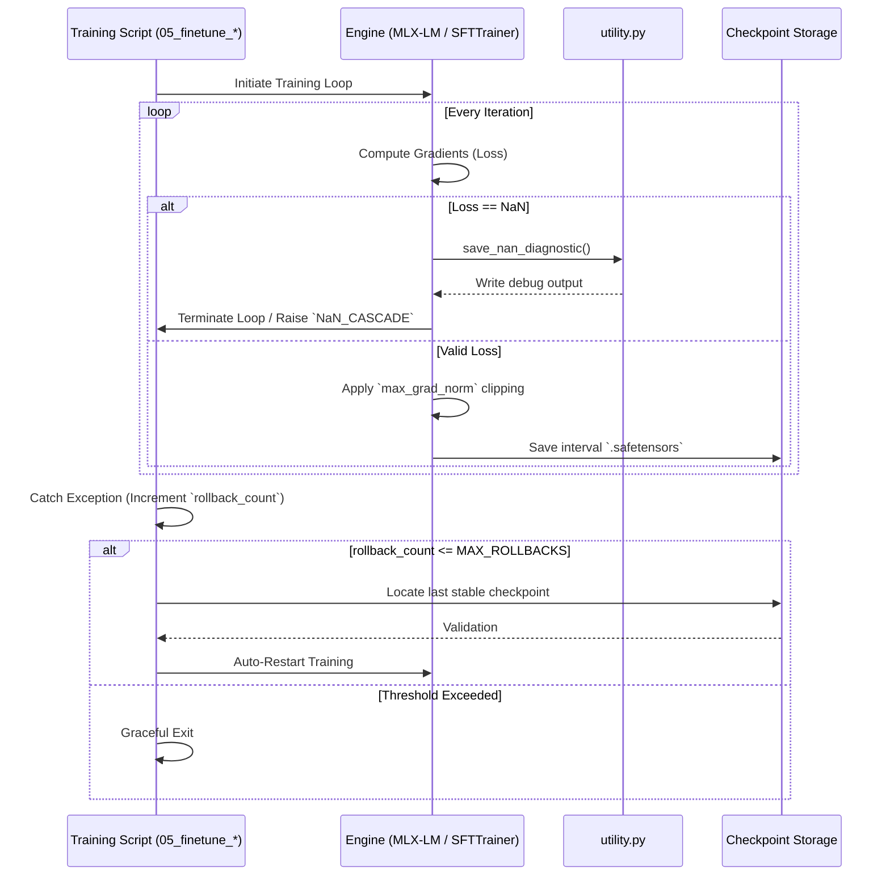

# 🛡️ TLF-7B-LLM-01: Ultra-Stable Dict-SFT Pipeline

[](https://www.python.org/downloads/)
[](LICENSE)
[](https://github.com/transliteral/TLF-7B-LLM-01/graphs/commit-activity)

**TLF-7B-LLM-01** is a high-performance, end-to-end Supervised Fine-Tuning (SFT) pipeline designed to transform raw dictionary databases into specialized Large Language Models. Built for precision and industrial-grade stability, it natively supports **Apple Silicon (MLX)** and **NVIDIA (HuggingFace)** backends.

---

## ✨ Key Features

- 🔄 **End-to-End ETL**: Automated extraction from MSSQL to normalized, de-duplicated SFT datasets.
- 🛡️ **NaN-Resilient Training**: Advanced "Diagnostic Trap" and **Auto-Skip** (Rollback & Skip) mechanism.
- ⚡ **Ultra-Efficient Prompting**: Zero-Persona mode with symbolic keyword markers (`Def:`, `Trans:`, etc.) and metadata isolation.
- 🏗️ **Multi-Task SFT**: Specialized training for Morphology, Translation, Ontology, Etymology, and more.
- 🍎 **MLX Optimized**: Native support for Apple Silicon with global gradient clipping patches.
- ⚡ **QLoRA Precision**: 4-bit quantization for memory-efficient training on 7B+ parameter models.
- 🔍 **Landmine Defense**: Intelligent detection and blacklisting of problematic Indic character sequences.

---

## 🚀 Quick Start

### 1. Installation
```bash
git clone https://github.com/transliteral/TLF-7B-LLM-01.git
cd TLF-7B-LLM-01
pip install -r requirements.txt
```

### 2. Configuration
Create a `.env` file in the root directory:
```env
DB_CONNECTION_STRING="your_odbc_connection_string"
HF_TOKEN="your_huggingface_token"
```

### 3. Run the Pipeline
The entire process is orchestrated via `run_pipeline.py`.
```bash
# Run all steps (Extraction to Training)
python code/dict/run_pipeline.py --step all
```

---

## 1. Executive Summary

##### An exhaustive architectural and programmatic breakdown of the TLF-7B-LLM-01 pipeline to finetune an openly available Large Language Model to fit Data from TransLiteral Foundations.

The pipeline's objective is to extract a large-scale dictionary SQL database, map its hierarchical contents structure, identify cross-references, normalize morphological variations, and generate a multi-task Supervised Fine-Tuning (SFT) dataset specialized for training dynamically assigned models (e.g., `Meta-Llama-3.1-8B`, `Qwen/Qwen2.5-7B`, `sarvamai/sarvam-1`) via QLoRA.

---

## 2. Global Architecture Flow



---

## 3. Configuration & Observability Reference

The pipeline is entirely driven by `code/dict/tlf_config.json`. The file is logically partitioned into functional blocks to ensure high maintainability and clarity.

### 3.1 Metadata & Observability

| Parameter         | Section            | Usage & Importance                                                |
| :---------------- | :----------------- | :---------------------------------------------------------------- |
| `_metadata`     | **Metadata** | Tracks pipeline version, description, and last update date.       |
| `log_dir`       | **Logging**  | The root directory for all generated logs (Default:`logs`).     |
| `default_level` | **Logging**  | Set global verbosity:`DEBUG`, `INFO`, `WARNING`, `ERROR`. |
| `steps`         | **Logging**  | A mapping of each script to its specific output `.log` file.    |

### 3.2 Global Paths & Database

| Parameter               | Section            | Usage & Importance                                              |
| :---------------------- | :----------------- | :-------------------------------------------------------------- |
| `connection_string`   | **Database** | ODBC string for Step 1 extraction. Requires ODBC Driver 18.     |
| `raw_dictionary_full` | **Paths**    | The target output file for the raw SQL dump (Step 1).           |
| `jsonl_input_dir`     | **Paths**    | Where Step 2 stores its subdivided 5,000-line chunks.           |
| `jsonl_output_dir`    | **Paths**    | Where Step 3 stores merged, contextualized chunks.              |
| `prompts_output_dir`  | **Paths**    | The final directory for LLaMA-formatted training data (Step 4). |
| `mapping_file`        | **Paths**    | Maps internal DB types (e.g.,`wordnet.indo`) to human terms.  |
| `extension_mappings`  | **Paths**    | Defines which DB extensions trigger which SFT Task.             |
| `references`          | **Paths**    | Maps reference codes to official textbook titles.               |

### 3.3 Data Processing (ETL)

| Parameter                      | Section              | Usage & Importance                                                   |
| :----------------------------- | :------------------- | :------------------------------------------------------------------- |
| `words_per_chunk`            | **Processing** | Limits lines per file in Step 2 to avoid RAM OOM (Default:`5000`). |
| `exclude_keywords`           | **Processing** | Skip words containing these (e.g., "unknown", "blank").              |
| `split_regex`                | **Processing** | How to separate definitions joined by "and", commas, or slashes.     |
| `seqno_extract_regex`        | **Processing** | Extracts numeric sequence numbers from meaning nodes.                |
| `dictionary_ref_regex`       | **Processing** | Extracts Manuscript Codes from HTML `<a>` tags.                    |
| `enable_suffix_substitution` | **Processing** | Toggles the zero-suffix substitution engine (Default:`false`).     |
| `suffix_substitution_regex`  | **Processing** | Merges Devanagari suffixes (e.g.,`०जाल` -> `अंकजाल`).  |
| `usage_ex_regex`             | **Processing** | Identifies the start of usage examples (e.g.,`Ex.`).               |
| `usage_quote_regex`          | **Processing** | Parses literary quotes and sources from usage text.                  |

### 3.4 Model Personas (System Prompts)

| Parameter              | Task | Persona Description                                  |
| :--------------------- | :--- | :--------------------------------------------------- |
| `task_a_morphology`  | A    | Expert bilingual lexicographer.                      |
| `task_b_translation` | B    | Exact translation generator across Indian languages. |
| `task_c1_etymology`  | C1   | Expert morphological and etymological parser.        |
| `task_c2_ontology`   | C2   | Semantic relationship and synonym expert.            |
| `task_d_meronymy`    | D    | Part-whole relationship specialist.                  |
| `task_e_references`  | E    | Classical citation and reference expert.             |

### 3.5 Fine-Tuning & Inference

| Parameter          | Section               | Usage & Importance                                             | Knowledge Link                                                                                                         |
| :----------------- | :-------------------- | :------------------------------------------------------------- | :--------------------------------------------------------------------------------------------------------------------- |
| `engine`         | **Fine-tuning** | `mlx` (Apple Silicon) or `hf` (Nvidia/PyTorch).            | -                                                                                                                      |
| `device`         | **Fine-tuning** | `mps` (Mac), `cuda` (Nvidia), or `auto`.                 | -                                                                                                                      |
| `model_id`       | **Fine-tuning** | Base HuggingFace model (Default:`sarvamai/sarvam-1`). | -                                                                                                                      |
| `epochs`         | **Fine-tuning** | Total passes over the dataset (Default:`5`).                 | [Epochs](https://machinelearningmastery.com/difference-between-a-batch-and-an-epoch/)                                     |
| `batch_size`     | **Fine-tuning** | Max batch size. Keep at `1` on Mac Metal.                    | [Batch Size](https://huggingface.co/docs/transformers/v4.18.0/en/performance#batch-size)                                  |
| `learning_rate`  | **Fine-tuning** | Optimizer step size (Default:`2e-5`).                        | [LR Guide](https://machinelearningmastery.com/understand-the-dynamics-of-learning-rate-on-deep-learning-neural-networks/) |
| `lora_r`         | **Fine-tuning** | Adapter rank (Default:`64`).                                 | [LoRA Paper](https://arxiv.org/abs/2106.09685)                                                                            |
| `max_seq_length` | **Fine-tuning** | Context window limit (Default:`512`).                        | [Seq Length](https://huggingface.co/blog/super-optimal-llm-training)                                                      |
| `temperature`    | **Inference**   | `0.3` is factual (Dictionary), `0.7+` is creative.         | -                                                                                                                      |
| `top_p`          | **Inference**   | Nucleus sampling probability (Default:`0.9`).                | -                                                                                                                      |

### 3.6 Security & Environment Variables

For security, sensitive credentials should not be stored in `tlf_config.json`. The pipeline natively supports parsing a `.env` file in the repository root containing:

* `DB_CONNECTION_STRING` (Overrides `['database']['connection_string']`)
* `HF_TOKEN` (Overrides `['finetuning']['hf_token']`)

---

## 4. Step-by-Step Pipeline Execution

### 4.1 ETL Data Flow Sequence



### Step 1: Database Extraction (`01_extract_db.py`)

**Core Function:** Queries the target MSSQL server, pulls all `Word` objects with their nested `Meaning` objects, resolving links and mappings.
**Regex Implementation: HTML Reference Parsing**

* **Pattern:** `r'<a href="/dictionary/(?P<InternalCode>[^/]+)/text\?ref=(?P<ReferenceCode>[^"]+)"[^>]*>(?P<RefText>[^<]+)</a>'`
* **Purpose:** The raw `MeaningText` frequently contains `<a>` tags pointing to classical textbooks (e.g., `text.manu`). This regex extracts the exact internal code (`text.manu`), the reference manuscript (`Ms.3.138`), and the visibly attached text.
* **Positive Handling:** Valid extractions format into a clean `References` JSON array within the word object.
* **False Positives:** Only matches dictionary application routes. External or malformed tags are safely bypassed to preserve text integrity.
* **Reference Audit:** Injects data from `references.json` to append the official manuscript `Title`. Generates a complete audit log (`reference_extraction_report.csv`) identifying every code successfully mapped or flagged as `"NOT FOUND"`.

### Step 2: File Chunking (`02_chunk_data.py`)

**Core Function:** High-performance sequential division.

* **Logic:** Reads `dictionary_full.jsonl` sequentially using low-memory file buffering. It counts lines, slicing the dataset into discrete blocks of 5,000 instructions (`dictionary_part_*.jsonl`).
* **Purpose:** Prevents Out-Of-Memory (OOM) errors during Python processing and protects HuggingFace Datasets loading arrays later in the pipeline.

## Key Pipeline Features
 - **Ultra-Stable Fine-Tuning Module**: Actively catches, logs, and circumvents NaN loss-spikes ("data landmines") during LoRA/QLoRA tuning by instantly dropping bad tensor batches and dynamically resurrecting from fallback checkpoints without pipeline restarts.
 - **Automated Prompt Agnosticism**: Fully supports Zero-Persona structural inference via a dynamic framework stored in `TLF_CONFIG.json`. Simply swap the `model_id` (Llama-2, Meta-Llama-3.1, Qwen2.5, Sarvam-1) and the dataset builder perfectly maps the unique Chat/Tokens instructions (e.g., ChatML for Qwen) right out of the box.
 - **Model-Isolated Training & Telemetry Subsystems**: To ensure absolute experimental preservation across multiple model tests, both the final trained LoRA checkpoints and all underlying analytics (`training_stats.csv`, `skipped_records.log`) are dynamically bucketed into segmented subdirectories directly appending the active `model_id`.
 
 ## Installation
### Step 3: Chunk Processing & Meaning Merging (`03_process_chunk.py`)

**Core Function:** Consolidates multi-step sequential definitions attached to a single term.

* **Logic:** Scans a JSONL chunk. If it detects multiple meaning entries belonging to the exact same `Source` dictionary, it concatenates their text via linebreaks.
* **Edge Case Avoidance:** Crucially, it traverses every child meaning in the sequence to harvest all respective `References`, `ManagedType` arrays, and `ExtensionLinks` before merging them into the final parent node. This guarantees no appended source citations are lost when compressing multiple paragraph meanings.
* **Exception:** Entries explicitly tagged with `wordnet.indo` or containing specific structured `Extensions` arrays are passed unmodified to preserve their highly specialized mappings.

### Step 4: SFT Dataset Generation (`04_build_dataset.py`)

**Core Function:** Translates normalized JSON architectures into strict model-specific instruction blocks dynamically acquired from `TLF_CONFIG.json` `prompt_templates` using the **Ultra-Efficient** "Zero-Persona" profile.

**Ultra-Efficient Profile Optimization:**
- **Zero-Persona Mode**: Skips the `<<SYS>>` block entirely to save ~25 tokens per prompt, improving model focus on input-output mapping.
- **Keyword Markers**: Replaces natural language prompts with short, efficient keywords:
  - `Def: {word}` -> Definition / Morphology
  - `Trans: {word}` -> Translations
  - `Syn: {word}` -> Synonyms / Ontology
  - `Cite: {word}` -> Literary Citations
- **Target Stripping**: Removes filler phrases like "is defined as:" and "Morphological properties:" for minimalist responses.
- **Token Safety**: Enforces a strict `1200` character limit per definition part to guarantee all sequences fit within the `512` token context window.

**Regex Implementation 1: Suffix Substitution (`०([^\W\d_]+)`)**

* **Purpose:** Many sub-entries are defined as root suffixes (e.g., `word="अंक"`, meaning contains `"०जाल"`). We must merge them into `"अंकजाल"`.
* **Configurable:** Driven by the `enable_suffix_substitution` flag in `tlf_config.json` (Defaults to `false`).
* **Conditions:** Matches the Devanagari zero `०` followed strictly by alphabet characters.
* **False Positives Avoided:** The sequence `[^\W\d_]+` explicitly forbids numbers from matching. Thus, the numeric string `"०९"` remains unmodified, averting critical translation failure for numerical data. Logs substitutions to `substitutions_log.txt`.

**Regex Implementation 2: Usage Extraction (`\bEx\.\s+` and `'([^']+)'\s*-\s*([^.]+)\.`)**

* **Purpose:** Extracts localized literary quotes from within base text to be presented cleanly as "Usage Examples" appended to Definitions.

**Categorized Multipurpose Tasks:**
Instructs LLaMA-2 across 5 distinct domains derived dynamically from `extension_mappings.json`:

* **Task A (Lexicography):** Primary dictionary translation containing `WordTextAlternate` representations inlined as `(also: Alt1, Alt2)`.
* **Task B (Translation):** Handles `iwn.lang.*` cross-translation targets.
* **Task C1 & C2 (Ontology & Etymology):** Targets relationship trees and root compounds.
* **Task D (Meronymy/Holonymy):** Categorizes subset-superset mappings.
* **Citations Generation (Task E):** Strictly focus on literary citations. Metadata isolation in Step 3 ensures citations are only presented once per word concept, eliminating redundancy.

### Step 5: Multi-Model QLoRA Fine-tuning (`05_finetune_model.py`)

**Core Function:** Executes the instruction-tuning loop based on the selected `engine` in `tlf_config.json`.

* **Dispatcher:** Automatically calls either `05_finetune_mlx.py` or `05_finetune_hf.py`.
* **Resume Capability:** Use the `--resume-from-checkpoint` flag with `run_pipeline.py` to pick up training where it last left off.
* **Flash Restart:** Use `--force-restart` to wipe the existing adapter directory and start fresh.
* **Speed:** Over 4x faster on Mac compared to PyTorch fallback.
* **Resumption:** Progress is stored in `raw/models/llama2-tlf-finetuned/` as LoRA adapters. Automatically resumes if `adapters.safetensors` exists.
* **Memory Management:** Enforces `--grad-checkpoint` and `--max-seq-length` to fit 7B models in ~14GB RAM.
* **Command-Line Overrides:** Supports `--iters` (iterations) and `--max-seq-length` to allow rapid testing and memory stress-testing without modifying the global `tlf_config.json`.
* **Gradient Clipping Patch (REQUIRED):** The `mlx-lm` environment must be manually patched to support global gradient clipping. This is critical for preventing NaN loss (Model Collapse).
  * **Fix:** `mx.clip_grad_norm(model.parameters(), config['max_grad_norm'])` in `trainer.py`.
  * **Config:** `max_grad_norm` in `tlf_config.json` (Default: `0.05`).

#### Engine B: HuggingFace (`05_finetune_hf.py`)

* **Hardware:** Optimized for Nvidia GPUs via CUDA.
* **Logic:** Uses `SFTTrainer` with 4-bit QLoRA.
* **Command-Line Overrides:** Supports `--iters` (mapped to `max_steps`) and `--max-seq-length` for consistency with the MLX engine.
* **Storage:** Saves progress in `raw/models/llama2-dict-finetuned/` using standard `checkpoint-XXX` folders.
* **Usage:** Automatically used if `engine` is set to `hf` in `tlf_config.json`.

---

## 5. Data Quality & Stability Guards

To ensure training stability and prevent numerical explosions (NaN loss), the pipeline implements three layers of automated data protection:

### 5.1 Systemic Text Normalization (`utility.py`)

All dictionary content is passed through `normalize_dictionary_text()` before dataset construction.

* **Number Standardization:** Corrects spacing in large numeric strings (e.g., `4, 32, 000` -> `4,32,000`). This prevents the tokenizer from fragmenting critical factual data into unstable sub-tokens.
* **Whitespace Compression:** Collapses multiple spaces and newlines to maintain a consistent density for the attention mechanism.
* **Reference Cleaning:** Sanitizes citation keys and markers to reduce token noise in long definitions.

### 5.2 Near-Duplicate Suppression (`04_build_dataset.py`)

The dataset generator uses a hashing mechanism to identify and skip redundant training examples.

* **Hash Logic:** `hash(Prompt + Response[:500])`.
* **Impact:** Reduces dataset size by ~15%, removing redundant instructions (like repeating common religious definitions across thousands of entries) that can lead to over-fitting and gradient spikes.

### 5.3 Automated Diagnostic Trap & Rollback

Both MLX and HF engines are equipped with a unified "Diagnostic Trap" and Auto-Rollback mechanism to handle numerical instability:



* **Detection**: If `loss` becomes `NaN` or `Inf`, training is immediately terminated via subprocess break (MLX) or custom `NaN_CASCADE` Exceptions (HF) to prevent saving corrupted weights.
* **Recovery (`max_rollbacks`)**: The scripts immediately isolate the last-known stable checkpoint (`.safetensors` in MLX, or `checkpoint-*` folders in HF) and automatically relaunch the training loop from that validated step up to 25 times.
* **Diagnostic Capture**: Concurrently, `save_nan_diagnostic()` saves the exact record (MLX) or step metadata (HF) that caused the failure to `nan_batch_debug.json` for post-mortem analysis.

### 5.4 The "Landmine" Defense (ETL Step 4)

Certain complex Devanagari compounds can trigger numerical collapse on Apple Silicon MPS regardless of hyperparameters.

* **Blacklisting**: The `validate_content()` function in `04_build_dataset.py` contains a hard-coded blacklist for identified "landmine" words (e.g., `अभिसम्भृत`).
* **Pruning**: These words are removed during Step 4 prompt generation, ensuring the resulting `train.jsonl` is numerically safe for the transformer block.

---

## 6. Directory Structure & Operations Hub

* **`raw/dict/1-dictionary_full.jsonl`**: The raw SQL dump (Step 1).
* **`raw/dict/2-jsonl/dictionary_part_*.jsonl`**: The 5k segregated strings (Step 2).
* **`raw/dict/3-chunks/dictionary_processed_*.jsonl`**: The merged contextual chunks (Step 3).
* **`raw/dict/4-prompts/instruction_dataset_*.jsonl`**: The final LLaMA-2 arrays (Step 4).
* **`raw/models/TLF-7B-MLX-01_{model_id}/`**: Optimized MLX adapter weights and logs.
* **`raw/models/TLF-7B-HF-01_{model_id}/`**: Standard HuggingFace QLoRA checkpoints.

---

## 7. Programmatic Architecture & Module Reference

The pipeline is composed of modular Python scripts located in `code/dict/`. Each module is independently executable but typically orchestrated via `run_pipeline.py`.

### 7.1 Data Extraction & Preparation

| Module                  | Purpose                                                           | Primary Inputs                                       |
| :---------------------- | :---------------------------------------------------------------- | :--------------------------------------------------- |
| `01_extract_db.py`    | MSSQL to JSONL extraction and reference title resolution.         | `tlf_config.json` (Database), `references.json`. |
| `02_chunk_data.py`    | Slices large JSONL files into 5k-line segments for memory safety. | `dictionary_full.jsonl`.                           |
| `03_process_chunk.py` | Merges sequential meanings and extract morphological types.       | `mapping.json`, Part chunks.                       |
| `04_build_dataset.py` | Generates model-specific instruction datasets with suffix merging.          | `extension_mappings.json`.                         |

### 7.2 Model Training & Optimization

| Module                   | Purpose                                                 | Primary Inputs                    |
| :----------------------- | :------------------------------------------------------ | :-------------------------------- |
| `05_finetune_model.py` | Dispatcher to select between MLX (Mac) and HF (Nvidia). | `tlf_config.json` (Finetuning). |
| `05_finetune_mlx.py`   | Optimized training for Apple Silicon Metal (MPS).       | `instruction_dataset_*.jsonl`.  |
| `05_finetune_hf.py`    | 4-bit QLoRA training for Nvidia GPUs (CUDA).            | `instruction_dataset_*.jsonl`.  |

### 7.3 Testing, deployment & Analytics

| Module                     | Purpose                                                 | Primary Inputs              |
| :------------------------- | :------------------------------------------------------ | :-------------------------- |
| `06_test_model.py`       | Interactive terminal console for LoRA adapter testing.  | `inference` config block. |
| `07_publish_model.py`    | Deploys trained adapters to the HuggingFace Hub.        | `huggingface_hub`.        |
| `08_analyze_training.py` | Visualizes training loss curves and convergence stats.  | `training_stats.csv`.     |
| `utility.py`             | Shared logging, config loading, and JSONL I/O services. | Universal.                  |

---

## 8. Development & Maintenance

To add a new task to the pipeline:

1. Define the task persona in `tlf_config.json [system_prompts]`.
2. Update `extension_mappings.json` to trigger the task for specific database extensions.
3. Use `utility.setup_logger(step_name="...")` for consistent observability.
4. Verify convergence via Step 8 (`08_analyze_training.py`).

---

## 9. Pipeline Execution Guide

The entire architecture is consolidated behind `code/dict/run_pipeline.py`. You do not need to run the individual scripts.

**Run the Entire Automation Sequence (Steps 1 through 5):**

```bash
python code/dict/run_pipeline.py --step all
```

**Run Individual Stages:**

```bash
# 1. Pull the MSSQL Database into a flat JSONL
python code/dict/run_pipeline.py --step 1

# 2. Slice the file into 5,000-line arrays to prevent Memory OOMs
python code/dict/run_pipeline.py --step 2

# 3. Consolidate Meaning hierarchies into single unified Word nodes
python code/dict/run_pipeline.py --step 3

# 4. Generate the LLaMA-2 Instruction datasets based on System Prompts
python code/dict/run_pipeline.py --step 4

# 5. Initiate QLoRA GPU Training (Auto-resumes from checkpoints)
python code/dict/run_pipeline.py --step 5
# 5b. Force a training restart, erasing existing adapter weights
python code/dict/run_pipeline.py --step 5 --force-restart
# 5c. Test training quickly by ONLY feeding it a single dataset chunk file
python code/dict/run_pipeline.py --step 5 --input_file "raw/dict/4-prompts/instruction_dataset_1.jsonl"
# 5d. Manual Override for quick testing (Permanent Features)
python code/dict/05_finetune_mlx.py --iters 100 --max-seq-length 512

# 6. Boot the Local Interactive Evaluator Console to test the LoRA (Side-by-Side Comparison)
python code/dict/06_test_model.py --compare

# 7. Generate a professional Model Card (README.md) for review
python code/dict/07_publish_model.py --dry-run

# 8. Analyze Training Statistics and Plot Progress
python code/dict/run_pipeline.py --step 8

# 9. Merge and Export to GGUF format for universal distribution
python code/dict/09_export_gguf.py --quantization Q4_K_M
```

### Step 8: Training Analytics & Plotting (`08_analyze_training.py`)

**Core Function:** Aggregates and visualizes training performance to ensure the model is converging correctly.

* **Data Collection:** Automatically reads `logs/mlx/training_stats.csv` or `logs/hf/training_stats.csv`. These files are generated in real-time during Step 5.
* **Visualization:** Generates `logs/training_progress.png`, plotting the Train/Val loss on a logarithmic scale. This is critical for spotting convergence patterns or "Model Collapse" (NaN spikes) early.
* **Versioning:** Logs are automatically versioned (timestamped) if you restart training, and appended if you resume.

---

## 🤝 Contributing

We welcome contributions! Please see [Chronicle.md](Chronicle.md) for the technical history and current development roadmap.

## 📄 License

This project is licensed under the MIT License - see the [LICENSE](LICENSE) file for details.

---
> [!NOTE]
> This documentation is autogenerated using continuous prompt engineering to ensure technical accuracy with the underlying codebase. Always check Step 8 after a few hundred iterations to ensure your `loss` is trending downwards!
